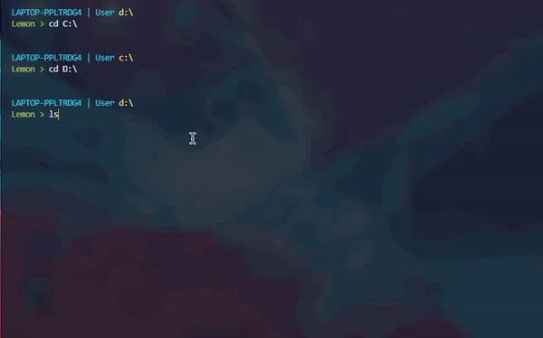

    
  </a>

<h1 align="center">Lemon Terminal</h1>

### Lemon is a custom, easy to use terminal shell made for the Windows Operating System

It is in it's early stages of development and dosent have many features but for now we have

- Changing modes
- Basic file managment commands
- Basic task managment commands
- System information commands

note: an alternative terminal emulator is recomended

## Links
[Project website](http://lemon-terminal.atwebpages.com)
[Project Blog](http://lemon-blog.atwebpages.com/)

## List of commands
#### Note: only the basic commands are here. A more detailed list is in command list.txt
- MODE = Changes the terminal mode (cmd, powershell, lemon)
- EXIT = Does exactly what it says
- CD = Changes the current working directory
- SHOWDIR = Prints the content of the current directory
- REMOVE = Removes a file or directory
- NEWDIR = Creates a new directory
- RENAME = Renames a file
- ENDTASK = Kills a process
- START = Starts a program
- CLEAR = Clears the screen

## Building binary from source code
Requierments:
- python 3 (obviously)
- pyinstaller
- ansi colors for python
- wmi
- psutils
- win32api
- shutil

Building:
- Change the directory to the src folder
- Type in this command
``
pyinstaller -F -i icon.ico lemon.py
``
