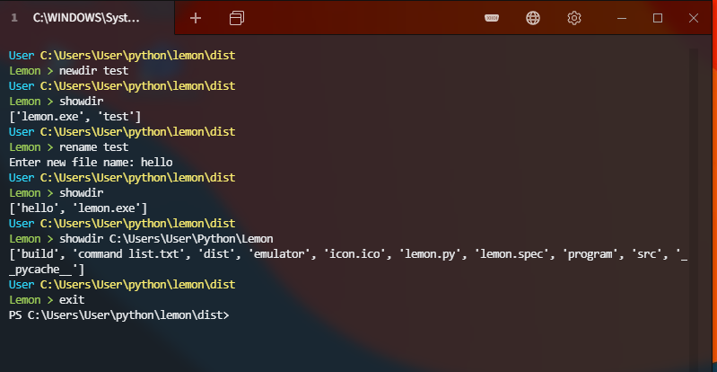

# Lemon
### Lemon is a custom terminal shell made for the windows OS

It is in it's early stage and dosent have many features but for now we have

Changing modes to
- Lemon (Uses custom lemon commands)
- Powershell (Uses powershell commands)
- Command prompt (Uses cmd commands)

note: an alternative terminal emulator is recomended

## List of commands
- MODE = Changes the terminal mode (cmd, powershell, lemon)
- EXIT = Does exactly what it says
- CD = Changes the current working directory
- SHOWDIR = Prints the content of the current directory
- REMOVE = Removes a file or directory
- NEWDIR = Creates a new directory
- RENAME = Renames a file
- ENDTASK = Kills a process
- START = Starts a program
- CLEAR = Clears the screen

## Building binary from source code
Requierments:
- python 3 (obviously)
- pyinstaller

Building:
- Change the directory to the src folder
- Type in this command
``
pyinstaller -F -i icon.ico lemon.py
``
